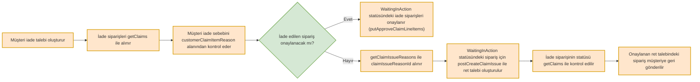

# İade Süreci Akışı

```mermaid
flowchart LR
  A["WaitingInAction statüsündeki iade siparişleri onaylanır (putApproveClaimLineItems)"]
  B{"İade edilen sipariş onaylanacak mı?"}
  C["Müşteri iade talebi oluşturur"]
  D["İade siparişleri getClaims ile alınır"]
  E["Müşteri iade sebebini customerClaimItemReason alanından kontrol eder"]
  F["getClaimIssueReasons ile claimIssueReasonId alınır"]
  G["WaitingInAction statüsündeki sipariş için postCreateClaimIssue ile ret talebi oluşturulur"]
  H["İade siparişinin statüsü getClaims ile kontrol edilir"]
  I["Onaylanan ret talebindeki sipariş müşteriye geri gönderilir"]

  C --> D
  D --> E
  E --> B
  B -->|Evet| A
  B -->|Hayır| F
  F --> G
  G --> H
  H --> I

  classDef process fill:#ffe6cc,stroke:#d79b00,stroke-width:2px
  classDef decision fill:#d5e8d4,stroke:#82b366,stroke-width:2px
  class A,C,D,E,F,G,H,I process
  class B decision
```