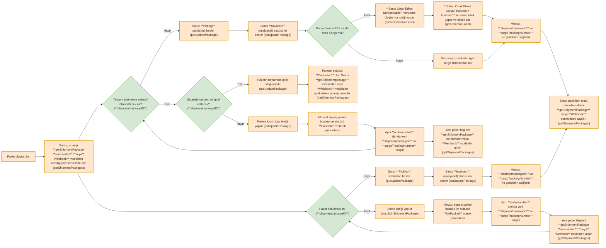

# Sipariş Süreci Akışı

  <DiagramDownload />

```mermaid
flowchart LR

A["**Satıcı Ortak Etiket Barkod talebi **servisine oluşturma isteği yapar (createCommonLabel)"]
B["**Satıcı Ortak Etiket Oluşan Barkodun Alınması** servisine istek yapar ve etiketi alır (getCommonLabel)"]
C{"Kargo firması TEX ya da Aras Kargo mu?"}
D["Satıcı **Picking** statüsünü besler (putUpdatePackage)"]
E["Satıcı **Invoiced** (opsiyonel) statüsünü besler (putUpdatePackage)"]
F["Mevcut **shipmentpackageid** ve **cargoTrackingNumber** ile gönderim sağlanır"]
G["Satıcı kargo etiketini ilgili kargo firmasından alır"]
H{"Tedarik edememe sebepli iptal edilecek mi? (**shipmentpackageID**)"}
I["Paketin tamamına iptal isteği yapılır (putUpdatePackage)"]
J["Paketin statüsü **Cancelled** olur. Satıcı **getShipmentpackage** servisinden veya **Webhook** modelden iptal edilen siparişi görebilir (getShipmentPackages)"]
K{"Siparişin tamamı mı iptal edilecek? (**shipmentpackageID**)"}
L["Pakete kısmi iptal isteği yapılır (putUpdatePackage)"]
M["Mevcut sipariş paketi bozulur ve statüsü **Cancelled** olarak güncellenir"]
N["Aynı **ordernumber** altında yeni **shipmentpackageid** ve **cargoTrackingNumber** oluşur"]
O["Yeni paket bilgileri **getShipmentPackage** servisinden veya **Webhook** modelden alınır (getShipmentPackages)"]
P["Satıcı paketinin statü güncellemelerini **getShipmentPackage** veya **Webhook** servisinden alabilir. (getShipmentPackages)"]
Q["Paket oluşturulur"]
R["Satıcı, siparişi **getShipmentPackage **servisinden** **veya** Webhook** modelden istediği parametrelerle alır (getShipmentPackages)"]
S["Satıcı **Picking** statüsünü besler (putUpdatePackage)"]
T["Satıcı **Invoiced** (opsiyonel) statusunu besler (putUpdatePackage)"]
U["Mevcut **shipmentpackageid** ve **cargoTrackingNumber** ile gönderim sağlanır"]
V{"Paket bölünecek mi (**shipmentpackageID**)"}
W["Bölme isteği yapılır (postSplitShipmentPackage)"]
X["Yeni paket bilgileri **getShipmentPackage **servisinden** **veya** Webhook** modelden alınır (getShipmentPackages)"]
Y["Mevcut sipariş paketi bozulur ve statüsü **UnPacked** olarak güncellenir"]
Z["Aynı **ordernumber** altında yeni **shipmentpackageid** ve **cargoTrackingNumber** oluşur"]

B --> F
Q --> R
H -->|Hayır| D
H -->|Evet| K
L --> M
M --> N
I --> J
D --> E
F --> P
K -->|Evet| I
K -->|Hayır| L
N --> H
R --> H
V -->|Hayır| S
V -->|Evet| W
S --> T
W --> Y
U --> P
Y --> Z
Z --> X
X --> V
T --> U
R --> V
C -->|Evet| A
C -->|Hayır| G
E --> C
A --> B
G --> F
N --> O

classDef style0 fill:#ffe6cc,stroke:#d79b00,stroke-width:2px
classDef style1 fill:#d5e8d4,stroke:#82b366,stroke-width:2px
class A,B,D,E,F,G,I,J,L,M,N,O,P,Q,R,S,T,U,W,X,Y,Z style0
class C,H,K,V style1 
```

 